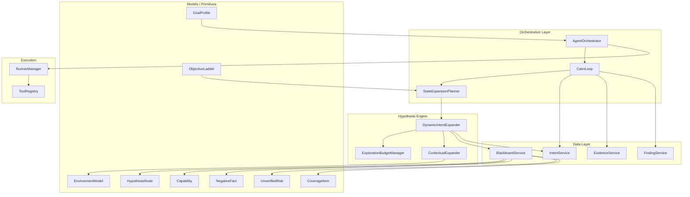

# Design Document: Hypothesis-Driven Autonomous Security Exploration System

## Overview

This design transforms the existing Cairn-loop security audit platform into a **Hypothesis-Driven Autonomous Security Exploration System**. The core architectural shift replaces static capability-rule expansion with a hypothesis lifecycle:

```
Observation → Hypothesis → ValidationIntent → Evidence → Capability / NegativeFact / UnverifiedRisk
```

The design preserves all existing infrastructure (Task, Evidence, Finding, Runner, Intent, Blackboard) and extends it with new primitives: `HypothesisNode`, `GoalProfile`, `EnvironmentModel`, `CoverageItem`, and `ObjectiveLadder`. New services (`DynamicIntentExpander`, `ExplorationBudgetManager`, `StateExpansionPlanner`) orchestrate hypothesis-driven exploration while the existing `AgentOrchestrator` and `CairnLoop` remain the execution backbone.

**Key Design Decisions:**
1. **Reuse AIIntent as ValidationIntent** — no parallel workflow engine. Hypothesis metadata stored in `ConstraintsJSON` with typed accessor methods.
2. **New tables only where necessary** — `GoalProfile`, `HypothesisNode`, `CoverageItem`, `ObjectiveLadder` get dedicated tables. `EnvironmentModel` is stored as a JSONB column on `AISecurityTask`.
3. **Contextual expansion over static rules** — the `DynamicIntentExpander` uses EnvironmentModel + graph state + NegativeFacts to form hypotheses, not `if capability == X: create intents`.
4. **Budget-controlled exploration** — `ExplorationBudgetManager` prevents graph explosion through branch limits, decay, and throttling.
5. **Backward compatibility** — existing tasks auto-receive default GoalProfiles; existing Capabilities link to synthetic `legacy_hypothesis` nodes.

---

## Architecture



### Execution Flow

1. **Bootstrap**: `GoalDecomposer` initializes GoalProfile, initial hypotheses, attack surface, and graph state.
2. **Reason**: `StateExpansionPlanner` evaluates pending hypotheses by branch value, selects highest-value ValidationIntents.
3. **Explore**: `AgentOrchestrator` executes ValidationIntents through Runners, producing Evidence.
4. **Reflect**: `DynamicIntentExpander` processes new observations, forms new hypotheses, updates EnvironmentModel, creates NegativeFacts/UnverifiedRisks.
5. **Terminate**: When stagnation detected (no new capabilities, no new hypotheses, budget exhausted).
6. **Report**: Generate evidence-backed exploration narrative with hypothesis chains.

---

## Components and Interfaces

### 1. GoalProfile Service

**Package:** `internal/service/goal_profile_service.go`

```go
type GoalProfileService struct {
    db *gorm.DB
}

func (s *GoalProfileService) Create(ctx context.Context, taskID uint, goalType, mode string, completionPolicy map[string]any) (model.AIGoalProfile, error)
func (s *GoalProfileService) GetByTask(ctx context.Context, taskID uint) (*model.AIGoalProfile, error)
func (s *GoalProfileService) AutoAssign(ctx context.Context, task model.AISecurityTask) (model.AIGoalProfile, error)
func (s *GoalProfileService) UpdateCompletionPolicy(ctx context.Context, id uint, policy map[string]any) error
```

**Auto-assignment rules:**
- `code_audit` → `coverage`
- `web_pentest` → `coverage`
- `internal_pentest` → `expansion`
- `terminal_proof` or explicit proof objective → `terminal`
- `hybrid` → infer from objective; default `coverage`

### 2. HypothesisNode Service

**Package:** `internal/service/hypothesis_service.go`

```go
type HypothesisService struct {
    db         *gorm.DB
    blackboard *BlackboardService
}

func (s *HypothesisService) Create(ctx context.Context, draft HypothesisDraft) (model.AIHypothesisNode, error)
func (s *HypothesisService) Validate(ctx context.Context, id uint, evidenceIDs []uint) (model.AIHypothesisNode, error)
func (s *HypothesisService) Refute(ctx context.Context, id uint, evidenceIDs []uint, reason string) (model.AIHypothesisNode, error)
func (s *HypothesisService) MarkInconclusive(ctx context.Context, id uint, reason string) (model.AIHypothesisNode, error)
func (s *HypothesisService) ListPending(ctx context.Context, taskID uint, limit int) ([]model.AIHypothesisNode, error)
func (s *HypothesisService) CreateImplicit(ctx context.Context, taskID uint, intentOrToolRunContext map[string]any) (model.AIHypothesisNode, error)
func (s *HypothesisService) ReduceSimilarPriority(ctx context.Context, taskID uint, refutedHypothesis model.AIHypothesisNode) error
```

**Lifecycle transitions:**
- `suspected` → `plausible` (more observations support it)
- `plausible` → `strong` (multiple observations)
- `suspected`/`plausible`/`strong` → `validated` (evidence confirms)
- `suspected`/`plausible`/`strong` → `refuted` (evidence disproves)
- `suspected`/`plausible`/`strong` → `inconclusive` (validation attempted, insufficient)

### 3. DynamicIntentExpander

**Package:** `internal/service/dynamic_intent_expander.go`

```go
type DynamicIntentExpander struct {
    db            *gorm.DB
    hypotheses    *HypothesisService
    intents       *IntentService
    blackboard    *BlackboardService
    budget        *ExplorationBudgetManager
    environment   *EnvironmentModelService
    goalProfiles  *GoalProfileService
}

func (e *DynamicIntentExpander) OnNewFact(ctx context.Context, taskID uint, fact model.AIBlackboardNode) error
func (e *DynamicIntentExpander) OnNewEvidence(ctx context.Context, taskID uint, evidence model.AIEvidence) error
func (e *DynamicIntentExpander) OnNewCapability(ctx context.Context, taskID uint, cap model.AICapability) error
func (e *DynamicIntentExpander) OnHypothesisFormed(ctx context.Context, taskID uint, hyp model.AIHypothesisNode) error
func (e *DynamicIntentExpander) OnNegativeFact(ctx context.Context, taskID uint, nf model.AIBlackboardNode) error
func (e *DynamicIntentExpander) OnEnvironmentUpdate(ctx context.Context, taskID uint) error
func (e *DynamicIntentExpander) GenerateValidationIntents(ctx context.Context, taskID uint) ([]model.AIIntent, error)
```

**Key behaviors:**
- Checks NegativeFacts before forming hypotheses
- Checks budget limits before generating intents
- Writes audit events for all decisions
- Uses EnvironmentModel to filter irrelevant hypotheses

### 4. ExplorationBudgetManager

**Package:** `internal/service/exploration_budget.go`

```go
type ExplorationBudgetManager struct {
    db  *gorm.DB
    cfg BudgetConfig
}

type BudgetConfig struct {
    MaxActiveBranches        int
    MaxPendingHypotheses     int
    MaxPendingIntents        int
    MaxIntentsPerRound       int
    BranchDecayRounds        int
    MaxGraphExpansionRate    int
}

func (m *ExplorationBudgetManager) CanFormHypothesis(ctx context.Context, taskID uint) (bool, string)
func (m *ExplorationBudgetManager) CanGenerateIntent(ctx context.Context, taskID uint) (bool, string)
func (m *ExplorationBudgetManager) ApplyDecay(ctx context.Context, taskID uint) error
func (m *ExplorationBudgetManager) GetMetrics(ctx context.Context, taskID uint) (BudgetMetrics, error)
func (m *ExplorationBudgetManager) SuppressDuplicates(ctx context.Context, taskID uint) (int, error)
```

### 5. StateExpansionPlanner (Refactored Reasoner)

**Package:** `internal/service/state_expansion_planner.go`

```go
type StateExpansionPlanner struct {
    db           *gorm.DB
    hypotheses   *HypothesisService
    budget       *ExplorationBudgetManager
    environment  *EnvironmentModelService
    goalProfiles *GoalProfileService
}

type BranchScore struct {
    HypothesisID       uint
    CapabilityGain     float64
    GraphExpansion     float64
    Novelty            float64
    RiskValue          float64
    Cost               float64
    EvidenceQuality    float64
    DuplicatePenalty   float64
    CoverageGain       float64
    TotalScore         float64
}

func (p *StateExpansionPlanner) ScoreBranches(ctx context.Context, taskID uint) ([]BranchScore, error)
func (p *StateExpansionPlanner) SelectNextIntents(ctx context.Context, taskID uint, maxIntents int) ([]model.AIIntent, error)
func (p *StateExpansionPlanner) ShouldTerminate(ctx context.Context, taskID uint, consecutiveNoProgress int) (bool, string)
```

**Scoring by GoalType:**
- `terminal`: Maximize direct proof path capability gain
- `coverage`: Balanced scoring across all factors
- `expansion`: Maximize ObjectiveLadder advancement

### 6. EnvironmentModel Service

**Package:** `internal/service/environment_model_service.go`

```go
type EnvironmentModelService struct {
    db         *gorm.DB
    blackboard *BlackboardService
}

type EnvironmentModel struct {
    RuntimeEnvironment      EnvironmentField `json:"runtime_environment"`
    DeploymentModel         EnvironmentField `json:"deployment_model"`
    FrameworkStack          EnvironmentField `json:"framework_stack"`
    CloudProvider           EnvironmentField `json:"cloud_provider"`
    IdentityModel           EnvironmentField `json:"identity_model"`
    NetworkZone             EnvironmentField `json:"network_zone"`
    ExecutionContext        EnvironmentField `json:"execution_context"`
    ContainerRuntime        EnvironmentField `json:"container_runtime"`
    OrchestrationLayer      EnvironmentField `json:"orchestration_layer"`
    AuthenticationMechanism EnvironmentField `json:"authentication_mechanism"`
    SessionModel            EnvironmentField `json:"session_model"`
}

type EnvironmentField struct {
    Value      string `json:"value"`
    Confidence string `json:"confidence"` // suspected / plausible / strong / confirmed
}

func (s *EnvironmentModelService) Get(ctx context.Context, taskID uint) (*EnvironmentModel, error)
func (s *EnvironmentModelService) UpdateFromEvidence(ctx context.Context, taskID uint, evidence model.AIEvidence) error
func (s *EnvironmentModelService) UpdateFromFact(ctx context.Context, taskID uint, fact model.AIBlackboardNode) error
func (s *EnvironmentModelService) IsRelevant(ctx context.Context, taskID uint, hypothesisType string) bool
```

### 7. GoalDecomposer (Bootstrap-Only)

**Package:** `internal/service/goal_decomposer.go`

```go
type GoalDecomposer struct {
    db           *gorm.DB
    hypotheses   *HypothesisService
    intents      *IntentService
    blackboard   *BlackboardService
    coverage     *CoverageService
    goalProfiles *GoalProfileService
}

func (d *GoalDecomposer) Bootstrap(ctx context.Context, task model.AISecurityTask) error
func (d *GoalDecomposer) BootstrapCodeAudit(ctx context.Context, task model.AISecurityTask, profile model.AIGoalProfile) error
func (d *GoalDecomposer) BootstrapWebPentest(ctx context.Context, task model.AISecurityTask, profile model.AIGoalProfile) error
func (d *GoalDecomposer) BootstrapExpansion(ctx context.Context, task model.AISecurityTask, profile model.AIGoalProfile) error
```

### 8. CoverageService

**Package:** `internal/service/coverage_service.go`

```go
type CoverageService struct {
    db *gorm.DB
}

func (s *CoverageService) Create(ctx context.Context, item model.AICoverageItem) (model.AICoverageItem, error)
func (s *CoverageService) UpdateStatus(ctx context.Context, id uint, status, reason string, evidenceRefs []uint) error
func (s *CoverageService) GetMatrix(ctx context.Context, taskID uint) ([]model.AICoverageItem, error)
func (s *CoverageService) EstimateCompleteness(ctx context.Context, taskID uint) (float64, error)
```

### 9. Intent Metadata Accessors

**Package:** `internal/model/intent_metadata.go`

```go
// ValidationIntentMeta provides typed access to hypothesis-related metadata
// stored in AIIntent.ConstraintsJSON for backward compatibility.
type ValidationIntentMeta struct {
    HypothesisID            uint   `json:"hypothesis_id"`
    ValidationMethod        string `json:"validation_method"`
    ExpectedEvidence        string `json:"expected_evidence"`
    ExpectedCapability      string `json:"expected_capability"`
    SuccessCondition        string `json:"success_condition"`
    FailureCondition        string `json:"failure_condition"`
    SafetyLevel             string `json:"safety_level"`
    EnvironmentContextSnap  string `json:"environment_context_snapshot"`
}

func (i *AIIntent) GetValidationMeta() (*ValidationIntentMeta, error)
func (i *AIIntent) SetValidationMeta(meta ValidationIntentMeta) error
```

---

## Data Models

### New Tables

#### AIGoalProfile

```go
type AIGoalProfile struct {
    ID               uint           `gorm:"primaryKey" json:"id"`
    TaskID           uint           `gorm:"uniqueIndex;not null" json:"taskId"`
    GoalType         string         `gorm:"size:40;index;not null;default:'coverage'" json:"goalType"` // terminal / coverage / expansion
    Name             string         `gorm:"size:220" json:"name"`
    Description      string         `gorm:"type:text" json:"description"`
    RawUserGoal      string         `gorm:"type:text" json:"rawUserGoal"`
    NormalizedGoal   string         `gorm:"type:text" json:"normalizedGoal"`
    Mode             string         `gorm:"size:40;not null;default:'web_pentest'" json:"mode"` // code_audit / web_pentest / internal_pentest / terminal_proof
    CompletionPolicy datatypes.JSON `gorm:"type:jsonb;default:'{}'" json:"completionPolicy"`
    CreatedAt        time.Time
    UpdatedAt        time.Time
}
```

#### AIHypothesisNode

```go
type AIHypothesisNode struct {
    ID                    uint           `gorm:"primaryKey" json:"id"`
    TaskID                uint           `gorm:"index;not null" json:"taskId"`
    HypothesisType        string         `gorm:"size:80;index;not null" json:"hypothesisType"`
    Title                 string         `gorm:"size:300;not null" json:"title"`
    Description           string         `gorm:"type:text" json:"description"`
    ConfidenceState       string         `gorm:"size:40;index;not null;default:'suspected'" json:"confidenceState"` // suspected / plausible / strong / validated / refuted / inconclusive
    Status                string         `gorm:"size:40;index;not null;default:'pending'" json:"status"` // pending / validating / resolved
    SourceObservationRefs datatypes.JSON `gorm:"type:jsonb;default:'[]'" json:"sourceObservationRefs"`
    SupportingEvidenceRefs datatypes.JSON `gorm:"type:jsonb;default:'[]'" json:"supportingEvidenceRefs"`
    TargetEntity          string         `gorm:"size:1200" json:"targetEntity"`
    ExpectedCapability    string         `gorm:"size:80" json:"expectedCapability"`
    ValidationIntentRefs  datatypes.JSON `gorm:"type:jsonb;default:'[]'" json:"validationIntentRefs"`
    NegativeFactRefs      datatypes.JSON `gorm:"type:jsonb;default:'[]'" json:"negativeFactRefs"`
    UnverifiedRiskRefs    datatypes.JSON `gorm:"type:jsonb;default:'[]'" json:"unverifiedRiskRefs"`
    ParentHypothesisID    *uint          `json:"parentHypothesisId"`
    CapabilityID          *uint          `json:"capabilityId"` // set when validated → capability
    PriorityScore         float64        `gorm:"index;default:0.5" json:"priorityScore"`
    DecayRounds           int            `gorm:"default:0" json:"decayRounds"`
    CreatedAt             time.Time
    UpdatedAt             time.Time
    ValidatedAt           *time.Time     `json:"validatedAt"`
}
```

#### AICoverageItem

```go
type AICoverageItem struct {
    ID            uint           `gorm:"primaryKey" json:"id"`
    TaskID        uint           `gorm:"index;not null" json:"taskId"`
    GoalProfileID uint           `gorm:"index;not null" json:"goalProfileId"`
    Category      string         `gorm:"size:60;index;not null" json:"category"` // entrypoint / auth_boundary / sink / endpoint / form / upload / download / business_logic / internal_asset
    Name          string         `gorm:"size:300;not null" json:"name"`
    TargetRef     string         `gorm:"size:1200" json:"targetRef"`
    RiskHint      string         `gorm:"size:200" json:"riskHint"`
    Status        string         `gorm:"size:40;index;not null;default:'discovered'" json:"status"` // discovered / tested / validated / negative / unverified / skipped
    Reason        string         `gorm:"type:text" json:"reason"`
    EvidenceRefs  datatypes.JSON `gorm:"type:jsonb;default:'[]'" json:"evidenceRefs"`
    NodeRefs      datatypes.JSON `gorm:"type:jsonb;default:'[]'" json:"nodeRefs"`
    CreatedAt     time.Time
    UpdatedAt     time.Time
}
```

#### AIObjectiveLadder

```go
type AIObjectiveLadder struct {
    ID            uint           `gorm:"primaryKey" json:"id"`
    TaskID        uint           `gorm:"index;not null" json:"taskId"`
    GoalProfileID uint           `gorm:"index;not null" json:"goalProfileId"`
    Level         int            `gorm:"not null" json:"level"` // 1-6
    Name          string         `gorm:"size:120;not null" json:"name"`
    Description   string         `gorm:"type:text" json:"description"`
    Status        string         `gorm:"size:40;not null;default:'pending'" json:"status"` // pending / in_progress / achieved / blocked
    AchievedAt    *time.Time     `json:"achievedAt"`
    CapabilityIDs datatypes.JSON `gorm:"type:jsonb;default:'[]'" json:"capabilityIds"`
    HypothesisIDs datatypes.JSON `gorm:"type:jsonb;default:'[]'" json:"hypothesisIds"`
    EvidenceRefs  datatypes.JSON `gorm:"type:jsonb;default:'[]'" json:"evidenceRefs"`
    CreatedAt     time.Time
    UpdatedAt     time.Time
}
```

### Modified Tables

#### AISecurityTask (add column)

```go
// New nullable JSONB column for EnvironmentModel
EnvironmentModelJSON datatypes.JSON `gorm:"type:jsonb" json:"environmentModelJson"`
```

#### AICapability (add columns)

```go
// New nullable column linking to the validated hypothesis
HypothesisID *uint `gorm:"index" json:"hypothesisId"`
// Chain reference for report narrative
ChainJSON    datatypes.JSON `gorm:"type:jsonb;default:'[]'" json:"chainJson"`
```

### Existing Tables Reused As-Is

- `AIIntent` — used as ValidationIntent with hypothesis metadata in `ConstraintsJSON`
- `AIBlackboardNode` — extended with new `NodeType` values (no schema change needed, `node_type` is varchar)
- `AIBlackboardEdge` — extended with new `EdgeType` values (no schema change needed, `edge_type` is varchar)
- `AIEvidence` — unchanged
- `AIFinding` — unchanged
- `AIToolRun` — unchanged
- `AIAuditEvent` — unchanged

### New Constants

```go
// GoalType values
const (
    GoalTypeTerminal  = "terminal"
    GoalTypeCoverage  = "coverage"
    GoalTypeExpansion = "expansion"
)

// GoalProfile Mode values
const (
    GoalModeCodeAudit      = "code_audit"
    GoalModeWebPentest     = "web_pentest"
    GoalModeInternalPentest = "internal_pentest"
    GoalModeTerminalProof  = "terminal_proof"
)

// HypothesisType values
const (
    HypInjectionCandidate          = "injection_candidate"
    HypAuthzBypassCandidate        = "authz_bypass_candidate"
    HypIDORCandidate               = "idor_candidate"
    HypMassAssignmentCandidate     = "mass_assignment_candidate"
    HypFileReadCandidate           = "file_read_candidate"
    HypFileWriteCandidate          = "file_write_candidate"
    HypUploadBypassCandidate       = "upload_bypass_candidate"
    HypCommandExecutionCandidate   = "command_execution_candidate"
    HypSSRFCandidate               = "ssrf_candidate"
    HypXSSCandidate                = "xss_candidate"
    HypSSTICandidate               = "ssti_candidate"
    HypXXECandidate                = "xxe_candidate"
    HypDeserializationCandidate    = "deserialization_candidate"
    HypSecretReuseCandidate        = "secret_reuse_candidate"
    HypCredentialReuseCandidate    = "credential_reuse_candidate"
    HypLateralAccessCandidate      = "lateral_access_candidate"
    HypKnownVulnCandidate          = "known_vuln_candidate"
    HypBusinessLogicCandidate      = "business_logic_candidate"
    HypInfoDisclosureCandidate     = "information_disclosure_candidate"
    HypSessionWeaknessCandidate    = "session_weakness_candidate"
    HypDependencyVulnCandidate     = "dependency_vulnerability_candidate"
)

// ConfidenceState values
const (
    ConfidenceSuspected    = "suspected"
    ConfidencePlausible    = "plausible"
    ConfidenceStrong       = "strong"
    ConfidenceValidated    = "validated"
    ConfidenceRefuted      = "refuted"
    ConfidenceInconclusive = "inconclusive"
)

// UnverifiedRisk reason values
const (
    UnverifiedReasonInsufficientAuth     = "insufficient_authorization"
    UnverifiedReasonInsufficientBudget   = "insufficient_budget"
    UnverifiedReasonInsufficientCap      = "insufficient_capability"
    UnverifiedReasonMissingCredentials   = "missing_credentials"
    UnverifiedReasonSafetyRestriction    = "safety_restriction"
    UnverifiedReasonInconclusiveEvidence = "inconclusive_evidence"
)

// CoverageItem categories
const (
    CoverageCatEntrypoint     = "entrypoint"
    CoverageCatAuthBoundary   = "auth_boundary"
    CoverageCatSink           = "sink"
    CoverageCatEndpoint       = "endpoint"
    CoverageCatForm           = "form"
    CoverageCatUpload         = "upload"
    CoverageCatDownload       = "download"
    CoverageCatBusinessLogic  = "business_logic"
    CoverageCatInternalAsset  = "internal_asset"
)

// CoverageItem statuses
const (
    CoverageStatusDiscovered = "discovered"
    CoverageStatusTested     = "tested"
    CoverageStatusValidated  = "validated"
    CoverageStatusNegative   = "negative"
    CoverageStatusUnverified = "unverified"
    CoverageStatusSkipped    = "skipped"
)

// ObjectiveLadder levels
const (
    LadderFoothold          = 1
    LadderLocalPrivilege    = 2
    LadderReachableAssets   = 3
    LadderIdentityExpansion = 4
    LadderCriticalAssets    = 5
    LadderHighValueProof    = 6
)

// Additional node types for blackboard
const (
    NodeEnvironmentModel = "environment_model"
    NodeCoverageGoal     = "coverage_goal"
    NodeExpansionGoal    = "expansion_goal"
    NodeEntrypoint       = "entrypoint"
    NodeAttackSurface    = "attack_surface"
    NodeAuthBoundary     = "auth_boundary"
    NodeDataflow         = "dataflow"
    NodeSink             = "sink"
    NodeTestedPath       = "tested_path"
    NodeUnverifiedRisk   = "unverified_risk"
    NodeCoverageItem     = "coverage_item"
)

// Additional edge types
const (
    EdgeForms           = "forms"
    EdgeGenerates       = "generates"
    EdgeProduces        = "produces"
    EdgeValidates       = "validates"
    EdgeRefutes         = "refutes"
    EdgeProducesCapability = "produces_capability"
    EdgeEnables         = "enables"
    EdgeDerivedFrom     = "derived_from"
    EdgeExpandsTo       = "expands_to"
    EdgeBlocks          = "blocks"
)
```

---
