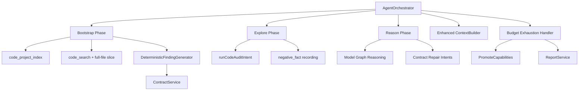

# Design Document

## Overview

This design addresses 9 requirements for overhauling the Rabbit AI Security Validation Platform's core agent loop, finding generation, and code analysis subsystems. The overhaul ensures the platform reliably identifies security vulnerabilities even when the AI model is unavailable or underperforming, by introducing deterministic fallback paths, richer context building, and graceful degradation.

**Key Design Principles:**
- Deterministic fallback: Every model-dependent path has a rule-based alternative
- Fail-forward: Failures are recorded and inform future decisions rather than being silently discarded
- Budget awareness: The system produces useful output regardless of when it terminates
- Cairn-style small prompts: Context stays under 6000 characters for fast model responses

## Architecture

The overhaul modifies 6 existing services and introduces 1 new subsystem:



**Modified Services:**
1. `ModelRuntimeService` — reasoning effort passthrough (Req 1)
2. `AgentOrchestrator` — bootstrap phase, reason budget, negative_fact, full-file slicing (Req 3, 5, 6, 8, 9)
3. `ContextBuilder` — enhanced context with missing fields, failed runs, file structure, source/sink pairs (Req 4)
4. `CairnLoop` — budget exhaustion handling, capability promotion (Req 9)
5. `ReportService` — incomplete finding indicators (Req 9)

**New Subsystem:**
6. `DeterministicFindingGenerator` — rule-based Source+Sink co-occurrence analysis (Req 2), integrated into `AgentOrchestrator`

## Components and Interfaces

### 1. ModelRuntimeService — Reasoning Effort Passthrough

**File:** `backend/internal/service/model_runtime_service.go`

**Change:** Modify `codeAuditReasoningEffort` to pass through user-configured values.

```go
// Current implementation already fixed per SYSTEM_ARCHITECTURE.md:
func codeAuditReasoningEffort(value string) string {
    v := strings.ToLower(strings.TrimSpace(value))
    if v == "" {
        return "medium"
    }
    return v
}
```

The function is called in graph reasoning model paths where it reads from `options.ReasoningEffort`. The `loadConfig` method extracts this from `AIModelConfig.OptionsJSON["modelReasoningEffort"]`.

**Interface unchanged** — the fix is internal to the function body.

### 2. Hypothesis-First Code Observation Handling

**File:** `backend/internal/service/agent_orchestrator.go`

**Current state:** Code evidence is treated as observation material. Source/Sink co-occurrence and pattern hits may create Blackboard facts, Hypothesis rows, and ValidationIntent rows, but they do not directly create confirmed Findings.

**Enhancement:** Keep code_search and code_slice in the Fact → Intent → Explore → Fact loop. Model graph reasoning can request additional facts or next intents, but Finding promotion remains evidence-backed and delivery-time only.

```go
// In the code audit path:
// code_search / code_slice -> Evidence
// Evidence -> Blackboard Fact
// Fact -> Hypothesis / ValidationIntent
// Validated Capability -> delivery Finding
func (o *AgentOrchestrator) runCodeAuditIntent(...) ([]ToolRunOutcome, error) {
    // execute observation and evidence tools only
}
```

**Deduplication:** Hypothesis and Intent deduplication are handled through lifecycle pattern keys, intent titles/objectives, and blackboard dedup seeds. FindingService remains a delivery artifact manager, not the exploration planner.

### 3. Reason Phase Budget Increase

**File:** `backend/internal/service/agent_orchestrator.go`

**Change:** Increase the no-progress threshold from 3 to 5 in `runLoopIterations`:

```go
// In runLoopIterations, change:
if consecutiveNoProgress >= 3 {
// To:
if consecutiveNoProgress >= 5 {
```

**Contract Boundary:** Contract checks are report delivery quality gates. The main loop no longer uses contract status as a fallback planner; when no pending intents exist, graph reasoning and dynamic expansion decide whether more exploration is valuable.

```go
// Contract can downgrade incomplete delivery artifacts.
// It must not replace DynamicIntentExpander or StateExpansionPlanner.
```

**Audit logging:** Already implemented — `appendAuditEvent` with type `"agent.no_progress"` fires when finalizing.


### 4. Enhanced ContextBuilder

**File:** `backend/internal/service/context_builder.go`

**Change:** Extend `AgentContext` struct and `Build` method to include additional fields.

```go
type AgentContext struct {
    Task              model.AISecurityTask     `json:"task"`
    Intent            *model.AIIntent          `json:"intent,omitempty"`
    KeyFacts          []model.AIBlackboardNode `json:"keyFacts"`
    RecentEvidence    []model.AIEvidence       `json:"recentEvidence"`
    OpenFindings      []model.AIFinding        `json:"openFindings"`
    AuthorizationView string                   `json:"authorizationView"`
    RecommendedNext   string                   `json:"recommendedNext"`
    // New fields:
    MissingFields     []string                 `json:"missingFields,omitempty"`
    FailedToolRuns    []FailedToolRunSummary    `json:"failedToolRuns,omitempty"`
    FileStructure     []string                 `json:"fileStructure,omitempty"`
    SourceSinkPairs   []SourceSinkPair         `json:"sourceSinkPairs,omitempty"`
    ProjectIndex      *ProjectIndexSummary     `json:"projectIndex,omitempty"`
}

type FailedToolRunSummary struct {
    ToolName  string `json:"toolName"`
    FilePath  string `json:"filePath,omitempty"`
    Error     string `json:"error"`
    Timestamp string `json:"timestamp"`
}

type SourceSinkPair struct {
    FilePath   string `json:"filePath"`
    SourceLine int    `json:"sourceLine"`
    SinkLine   int    `json:"sinkLine"`
    SourceType string `json:"sourceType"`
    SinkType   string `json:"sinkType"`
}

type ProjectIndexSummary struct {
    Language       string   `json:"language"`
    Framework      string   `json:"framework"`
    EntryFiles     []string `json:"entryFiles"`
    Routes         []string `json:"routes"`
    SensitiveOps   []string `json:"sensitiveOps"`
}
```

**Build method changes:**

1. **MissingFields:** Query hint-type blackboard nodes (`node_type = 'hint'`) and extract missing field names from their `ContentJSON`.
2. **FailedToolRuns:** Query `AIToolRun` where `status = 'failed'`, order by `started_at DESC`, limit 10.
3. **FileStructure:** Extract unique file paths from evidence items (`file_path IS NOT NULL`).
4. **SourceSinkPairs:** Group evidence by file, identify files with both source and sink patterns.
5. **ProjectIndex:** Query `code_fact` type blackboard nodes for project index data.

**6000 character budget enforcement:**

```go
func (b *ContextBuilder) Build(ctx context.Context, taskID uint, intent *model.AIIntent, maxItems int) (AgentContext, error) {
    // ... build all fields ...
    // Enforce 6000 char budget by truncating lower-priority fields
    result := AgentContext{...}
    b.enforceCharBudget(&result, 6000)
    return result, nil
}

func (b *ContextBuilder) enforceCharBudget(ctx *AgentContext, maxChars int) {
    // Priority order: Task > Intent > ProjectIndex > OpenFindings > KeyFacts > 
    //                 SourceSinkPairs > MissingFields > FailedToolRuns > FileStructure > Evidence
    // Progressively trim lower-priority fields until under budget
    for estimateSize(ctx) > maxChars {
        // Trim RecentEvidence first, then FileStructure, then FailedToolRuns, etc.
        if len(ctx.RecentEvidence) > 5 {
            ctx.RecentEvidence = ctx.RecentEvidence[:5]
            continue
        }
        if len(ctx.FileStructure) > 10 {
            ctx.FileStructure = ctx.FileStructure[:10]
            continue
        }
        // ... continue trimming
        break
    }
}
```

### 5. Code Slice Failure Recording

**File:** `backend/internal/service/agent_orchestrator.go`

**Change:** In `runCodeAuditIntent` and `runSingleFileAudit`, when `code_slice` fails, write a `negative_fact` node.

```go
// In runCodeAuditIntent, after code_slice execution:
sliceOutcome, sliceErr := o.toolRuns.Execute(ctx, ToolRunRequest{...})
if sliceErr != nil {
    // Write negative_fact to blackboard
    o.blackboard.UpsertNode(ctx, BlackboardNodeDraft{
        TaskID:          task.ID,
        NodeType:        "negative_fact",
        Title:           fmt.Sprintf("code_slice failed: %s", item.FilePath),
        Summary:         fmt.Sprintf("code_slice execution failed for %s: %s", item.FilePath, sliceErr.Error()),
        Content:         map[string]any{"filePath": item.FilePath, "error": sliceErr.Error(), "line": lineValue(item.LineStart)},
        DedupSeed:       fmt.Sprintf("negative-code-slice-%s-%d", item.FilePath, lineValue(item.LineStart)),
        ImportanceScore: 0.75,
        SourceType:      "tool",
        SourceID:        fmt.Sprintf("intent-%d", intent.ID),
    })
    continue
}
outcomes = append(outcomes, sliceOutcome)
```

**Importance score 0.75** ensures the negative_fact appears in the top-30 context items (most facts have scores 0.5-0.9).

**Avoidance logic in Reason Phase:** When generating new intents, check for negative_fact nodes:

```go
func (o *AgentOrchestrator) isFailedPath(ctx context.Context, taskID uint, filePath string) bool {
    var count int64
    o.db.WithContext(ctx).Model(&model.AIBlackboardNode{}).
        Where("task_id = ? AND node_type = ? AND status = ? AND content_json @> ?",
            taskID, "negative_fact", model.BlackboardNodeStatusActive,
            mustJSON(map[string]any{"filePath": filePath})).
        Count(&count)
    return count > 0
}
```

### 6. Same-File Source+Sink Full-File Slicing

**File:** `backend/internal/service/agent_orchestrator.go`

**Change:** After `code_search` completes in `runCodeAuditIntent`, identify files with both source and sink patterns and trigger full-file slicing.

```go
func (o *AgentOrchestrator) triggerFullFileSlicing(ctx context.Context, task *model.AISecurityTask, intent *model.AIIntent, iteration *model.AIAgentLoopIteration, root string, items []model.AIEvidence) []ToolRunOutcome {
    // Build file security index
    fileIndex := o.buildFileSecurityIndex(items)
    var outcomes []ToolRunOutcome
    
    for _, info := range fileIndex {
        if len(info.Sources) == 0 || len(info.Sinks) == 0 {
            continue
        }
        // Check if already fully sliced
        if o.hasFullFileSlice(ctx, task.ID, info.FilePath) {
            continue
        }
        // Request full-file slice (radius = 9999 means entire file)
        sliceInput := map[string]any{
            "taskId":   task.ID,
            "root":     root,
            "filePath": info.FilePath,
            "line":     1,
            "radius":   9999, // Full file
        }
        outcome, err := o.toolRuns.Execute(ctx, ToolRunRequest{
            TaskID:     task.ID,
            IntentID:   &intent.ID,
            IterID:     &iteration.ID,
            RunnerType: "code_audit",
            ToolName:   "code_slice",
            Input:      mustJSON(sliceInput),
        })
        if err != nil {
            o.blackboard.UpsertNode(ctx, BlackboardNodeDraft{
                TaskID:          task.ID,
                NodeType:        "negative_fact",
                Title:           fmt.Sprintf("Full-file slice failed: %s", info.FilePath),
                Summary:         err.Error(),
                Content:         map[string]any{"filePath": info.FilePath, "error": err.Error()},
                DedupSeed:       fmt.Sprintf("negative-fullslice-%s", info.FilePath),
                ImportanceScore: 0.75,
                SourceType:      "tool",
            })
            continue
        }
        // Store with metadata including source+sink line numbers
        outcome.Metadata["sourceLines"] = info.SourceLines
        outcome.Metadata["sinkLines"] = info.SinkLines
        outcome.Metadata["fullFile"] = true
        outcomes = append(outcomes, outcome)
    }
    return outcomes
}

func (o *AgentOrchestrator) hasFullFileSlice(ctx context.Context, taskID uint, filePath string) bool {
    var count int64
    o.db.WithContext(ctx).Model(&model.AIEvidence{}).
        Where("task_id = ? AND file_path = ? AND relation_type = ? AND summary LIKE ?",
            taskID, filePath, "code_source", "%full-file%").
        Count(&count)
    return count > 0
}
```

**Evidence storage:** The full-file slice is stored as a single `AIEvidence` item with:
- `EvidenceType`: `"code_snippet"`
- `RelationType`: `"code_source"`
- `Summary`: `"Full-file slice for source+sink analysis: {filePath}"`
- `Metadata` (via ToolResult): includes `sourceLines`, `sinkLines`, `fullFile: true`

### 7. Code Project Index Integration

**File:** `backend/internal/service/agent_orchestrator.go`

**Change:** Execute `code_project_index` as the first operation in the Bootstrap phase.

```go
func (o *AgentOrchestrator) runBootstrapProjectIndex(ctx context.Context, task *model.AISecurityTask, intent *model.AIIntent, iteration *model.AIAgentLoopIteration, root string) (*tools.ToolResult, error) {
    indexInput := map[string]any{
        "taskId": task.ID,
        "root":   root,
    }
    outcome, err := o.toolRuns.Execute(ctx, ToolRunRequest{
        TaskID:     task.ID,
        IntentID:   &intent.ID,
        IterID:     &iteration.ID,
        RunnerType: "code_audit",
        ToolName:   "code_project_index",
        Input:      mustJSON(indexInput),
    })
    if err != nil {
        return nil, err
    }
    // Write project index results as structured code_fact nodes
    o.writeProjectIndexFacts(ctx, task.ID, outcome.Result)
    return outcome.Result, nil
}

func (o *AgentOrchestrator) writeProjectIndexFacts(ctx context.Context, taskID uint, result *tools.ToolResult) {
    if result == nil {
        return
    }
    index := tools.ParseProjectIndex(result.Stdout)
    // Write language/framework fact
    o.blackboard.UpsertNode(ctx, BlackboardNodeDraft{
        TaskID:          taskID,
        NodeType:        "code_fact",
        Title:           fmt.Sprintf("Project: %s / %s", index.Language, index.Framework),
        Summary:         fmt.Sprintf("Language: %s, Framework: %s, Entry files: %d, Routes: %d", index.Language, index.Framework, len(index.EntryFiles), len(index.Routes)),
        Content:         map[string]any{"language": index.Language, "framework": index.Framework, "entryFiles": index.EntryFiles, "routes": index.Routes, "authMiddleware": index.AuthMiddleware, "dataModels": index.DataModels, "sensitiveOps": index.SensitiveOps},
        DedupSeed:       "project-index",
        ImportanceScore: 0.95,
        SourceType:      "tool",
        SourceID:        "code_project_index",
    })
}
```

**ContextBuilder integration:** The `Build` method queries for `code_fact` nodes with dedup_seed `"project-index"` and populates the `ProjectIndex` field.
